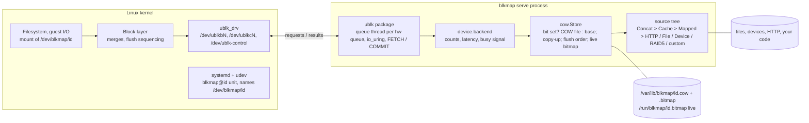
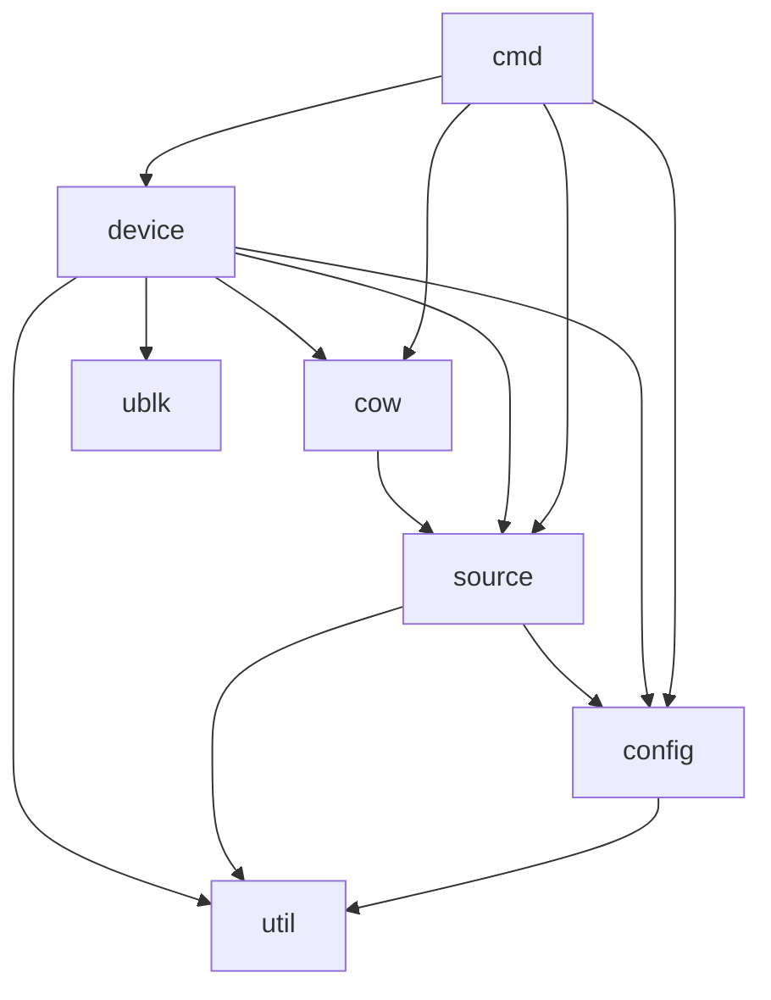
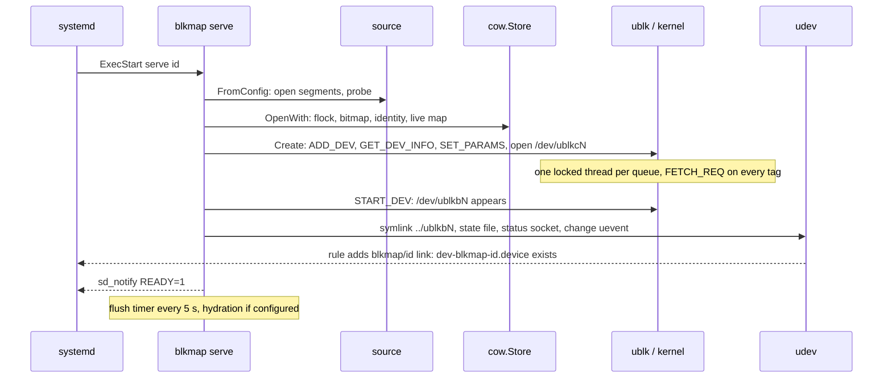
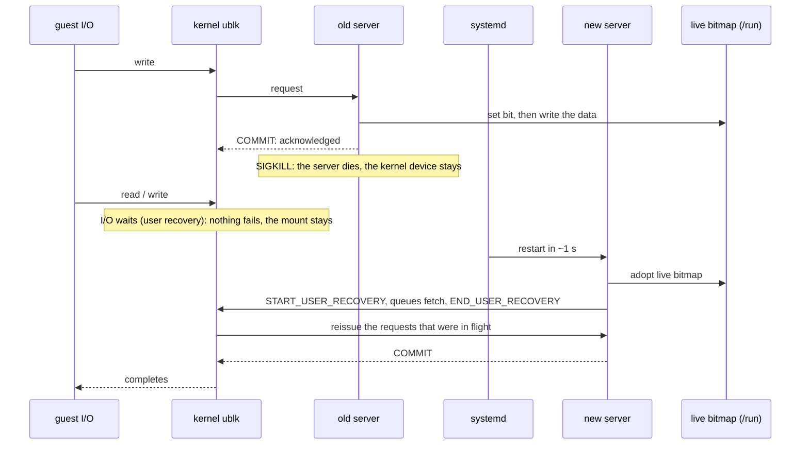
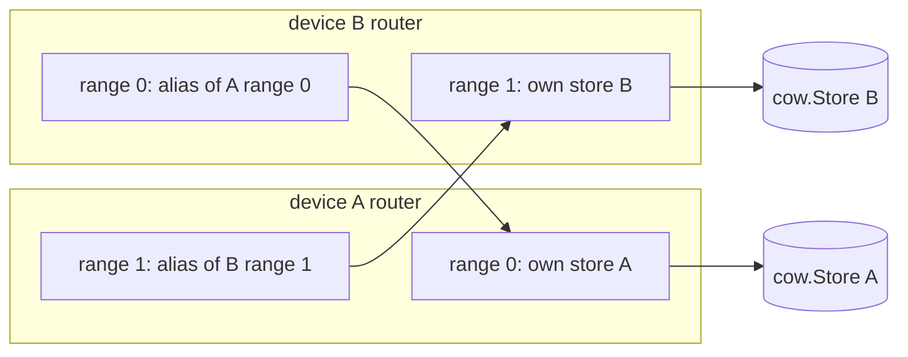

# blkmap internals: how it works

Internal companion to the README: how the parts fit, the sequence of calls on every
important path, and real command output (blkmap 0.1.1, Ubuntu 26.04, kernel 7.0). The same
text with editable diagrams lives in the Claude doc "blkmap internals: how it works".

## Overview

blkmap is a userspace block device: one YAML file describes a read-only *base* stitched from
sources (files, block devices, HTTP URLs, zero ranges, RAID-5 sets, cache tiers, your own
code), the kernel's `ublk` driver hands the process every request for `/dev/blkmap/<id>`,
and every write lands in a separate copy-on-write (COW) file next to a bitmap that says
which 64 KiB chunks the COW file now owns. Reads of owned chunks come from the COW file;
everything else comes from the base. Nothing is ever written to a source.

Three layers, each a Go package, each usable on its own:

- `ublk` moves requests between the kernel and a Go `Backend` (ReadAt, WriteAt, Flush,
  Discard): one io_uring and one OS thread per hardware queue, 1 MiB per-tag buffers, a
  control plane over `/dev/ublk-control`.
- `cow` is that backend: a `Store` over any `source.Source`, the chunk bitmap, flush ordering
  (data before bits), elision, writeback, the live bitmap that survives a crash.
- `source` builds the base: `Concat` of segments, `Cache` (fast tier over slow), `Mapped`
  (data-extent map so holes are never fetched), `HTTP` with a block cache and read-ahead,
  `RAID5` with parity reconstruction, `File`, `Zero`, `Swappable`, custom sources.

`device` ties them to the operating system (config to device, publish `/dev/blkmap/<id>`,
systemd notify, status socket, hydration, crash recovery, device groups); `cmd` is the thin
CLI (`serve`, `validate`, `map`, `pin`, `status`, `metrics`, `reap`, `udev-name`).



## Package layout

| Package | Files | What it owns |
|---|---|---|
| `cmd` | app, serve, validate, map, pin, status, reap, udev, util | The CLI: parse arguments, load config, call into `device`, print |
| `device` | service, group, hydrate, backend, status, udev | A config or `Options` to a live device: store, ublk device, publish, status socket, hydration, recovery, groups |
| `cow` | service, bitmap | `Store` (the ublk backend): bitmap, copy-up, flush ordering, discard, elision, writeback, hydration primitives; `Bitmap` format and live file |
| `source` | source, concat, file, zero, http, blockcache, readahead, cache, map, range, raid5, swappable, custom, bind, identity, util | The read-only base: `Source` and every source type, holes and maps, content identity |
| `ublk` | uapi, ring, control, queue, service | The kernel transport: ioctl encoding, minimal io_uring, control commands, queue threads and dispatch, create/stop/delete/recover |
| `config` | types, config | YAML parsing and validation |
| `util` | size, sdnotify, bitset | Sizes, `sd_notify`, a bitset |



The interfaces that join the packages are small: `source.Source` (`ReadAt`, `Size`, `Close`,
optionally `Sparse`, `DirectReader`, `Aborter`, `Identifier`, `Binder`); `ublk.Backend`
(`ReadAt`, `WriteAt`, `Size`, `Flush`, optionally `Discarder`, `ZeroWriter`), implemented by
`cow.Store`; `device.Options`, the library entry point: `device.Serve(ctx, &Options{ID, Base,
COWFile})` makes any Source a block device.

## Lifecycle: start, shutdown, crash recovery

1. **Config to base.** `source.FromConfig` opens every segment (a file is opened and
   `SEEK_HOLE`-probed, an HTTP URL gets a one-byte Range probe for size and validators, RAID
   members are assembled) into one `Concat`. If the bitmap already says every chunk is in
   the COW file, the sources are not opened: the base becomes `source.NewZero(size)` and the
   device runs detached.
2. **Store.** `cow.OpenWith` flocks the COW file (a second server gets "in use"), opens or
   creates the bitmap, checks geometry and the base's identity against what is recorded,
   refuses a missing or truncated COW file when bits say data exists, and attaches the live
   bitmap in `/run/blkmap/<id>.bitmap`.
3. **Kernel device.** `ublk.Create`: `ADD_DEV`, `GET_DEV_INFO`, `SET_PARAMS`, open
   `/dev/ublkcN`, one locked OS thread per queue (each primes its tags with `FETCH_REQ`),
   `START_DEV`. With a predecessor waiting (crash or reload), `ublk.Recover` runs
   `START_USER_RECOVERY`, the queues re-fetch, `END_USER_RECOVERY`, and the kernel reissues
   the in-flight requests.
4. **Publish.** Symlink `/dev/blkmap/<id>` in udev's relative form (`../ublkb0`),
   `/run/blkmap/<id>` with `"<ublk id> <pid>"`, a `change` uevent so the udev rule runs and
   systemd gets a `dev-blkmap-<id>.device` unit, the status socket, `read_ahead_kb=4096`,
   `sd_notify(READY=1)`.
5. **Background work.** Flush timer every 5 s, hydration if configured.



Shutdown (`SIGTERM`) runs in the one order that cannot lose data: stop background work;
`Abort` the base so a read blocked in a dead origin fails instead of holding everything up;
`STOP_DEV` (the kernel drains in-flight requests, queue threads exit); flush and close the
store (COW data `fdatasync`, then bitmap pages); `DEL_DEV`, which waits for anyone holding
the block device open, so unmount first; remove symlink and state file if still ours.

**Crash.** The device is created with the ublk user-recovery flags, so when the server dies
the device stays and I/O pauses. systemd restarts the unit (`Restart=on-failure`,
`RestartMode=direct`); the new process finds the state file, sees the recorded pid is dead
and the device waiting, and re-attaches. Writes acknowledged but unflushed survive because
every bit was set in the live bitmap (a shared mapping of a tmpfs file) before the
acknowledgement, and the new server adopts that file.



Real output after `kill -9` of a server with a mounted filesystem under load:

```
12:35:06 systemd[1]: blkmap@doc.service: Main process exited, code=killed, status=9/KILL
12:35:07 systemd[1]: blkmap@doc.service: Scheduled restart job, restart counter is at 1.
12:35:07 blkmap[324131]: doc: re-attached to ublk device 0; I/O resumes
12:35:07 blkmap[324131]: serving /dev/blkmap/doc (/dev/ublkb0): 1280M, 2 segments, 20480/20480 chunks in cow file
$ blkmap status doc
doc  /dev/blkmap/doc -> /dev/ublkb0  pid 324131, up 2s
  size 1280M, 20480/20480 chunks in the cow file (100%), re-attached after a restart, unflushed writes
```

`systemctl reload` is the same path: `Detach` hands the device over without flushing or
waiting, the process re-executes the installed binary, and that binary re-attaches; package
upgrades use it. If a server cannot come back, systemd gives up after 10 attempts in 60 s
and `blkmap-reap@<id>` runs `blkmap reap <id>`, which stops the waiting device so its I/O
fails instead of hanging.

## The ublk transport

**Control plane.** `/dev/ublk-control` takes ioctl-encoded commands as io_uring `URING_CMD`
submissions (`ADD_DEV`, `SET_PARAMS`, `START_DEV`, `STOP_DEV`, `DEL_DEV`, `GET_DEV_INFO`,
`START_USER_RECOVERY`, `END_USER_RECOVERY`). Each call opens a small ring, submits one
command tagged with a sequence number (a late completion of a timed-out command is told
apart), and waits up to 30 s; a timed-out control is poisoned and pinned, since the kernel
may still write into its buffers.

**Data plane.** Per hardware queue (CPUs, at most 4): one io_uring with `SQE128`/`CQE32`,
one OS thread locked for the device's life, a read-only mmap of the request descriptors, a
private buffer of depth x 1 MiB (depth 64, so at most 256 MiB per device, touched lazily).
Every tag starts with `FETCH_REQ`; a completion names the tag, the thread serves it, and
`COMMIT_AND_FETCH_REQ` returns the result and re-arms the tag. `-ENODEV` on a fetch means the
kernel is aborting the queue.

**Dispatch.** A queue serves requests inline on its own thread while the smoothed read
service time is low; above 250 us it switches to parallel mode and hands reads and writes to
depth worker goroutines (one backend call per tag), which post finished tags on an eventfd
read through the same ring. It returns to inline only after 1,024 consecutive fast reads, so
cache hits cannot flip it back and stall everything behind the next slow read. Flushes,
discards and zeroing always run inline.

**Safety.** A data request outside the device is refused with `EIO` before the backend sees
it (a flush carries sector -1 and is exempt). A queue loop that dies while the device is live
closes `Device.Done()`, and `blkmap serve` exits non-zero. `Stop` joins the queue threads
even when the control device cannot be opened. The transport cannot survive its own process
dying with requests in flight on a kernel without user recovery, which is why the unit sets
`OOMScoreAdjust=-900` and never `MemoryMax`.

## Request paths

```mermaid
sequenceDiagram
  participant K as kernel
  participant Q as ublk queue
  participant B as backend
  participant S as cow.Store
  participant F as COW file
  participant R as base source
  rect rgb(235,240,250)
  K->>Q: read tag
  Q->>B: ReadAt (inline or worker)
  B->>S: count, time, ReadAt
  S->>F: written runs: pread
  S->>R: unwritten runs: one ReadAt
  Q-->>K: COMMIT n bytes
  end
  K->>Q: write tag (first write to a chunk)
  Q->>S: WriteAt via backend; chunk lock
  S->>R: copy-up: read the whole chunk
  S->>F: write chunk; set bit (live map first)
  Q-->>K: COMMIT n bytes
  K->>Q: flush
  S->>F: fdatasync data, then bitmap pages
  Q-->>K: COMMIT ok
```

**Read.** `Store.ReadAt` walks the request in runs of chunks with the same state: a run the
bitmap marks written is one `pread` from the COW file, a run of unwritten chunks is one
`ReadAt` on the base, so a 1 MiB request over an unhydrated region reaches a remote source
once. Every read must return the full count; a base cut short is `io.ErrUnexpectedEOF`,
never stale bytes. Inside the base: `Concat` binary-searches the segment, `Cache` tries the
fast tier and falls through on `ErrNotFound` or any error, `Mapped` zero-fills holes locally,
`HTTP` serves from its 1 MiB block cache or fetches the block with a Range request.

**Write.** `Store.WriteAt` splits at chunk boundaries under a striped lock per chunk (1,024
stripes). A chunk already in the COW file is written in place (the COW file is a sparse image
of the device, offsets are identical). A first write is a *copy-up*: read the whole chunk
from the base into a pooled buffer, overlay the bytes, write the chunk, set the bit (live
bitmap first). A whole-chunk first write skips the base read. With elision on, a write equal
to what the device already reads is dropped.

**Flush.** A bit on disk never describes data that is not: `Flush` snapshots the dirty
bitmap pages, `fdatasync`s the COW file, then writes that snapshot and syncs the bitmap. A
bit set between snapshot and sync stays dirty for the next flush. Flush runs on every guest
flush, on the 5 s timer when dirty, and at shutdown.

**Discard and write-zeroes.** `Discard` punches a hole for every whole chunk already in the
COW file (it keeps its bit, reads as zeros, stops using space); partial and unwritten chunks
are left alone. `WriteZeroes` punches whole chunks and marks them written, partial chunks go
through the normal write path. Both are advertised with a 1 GiB maximum.

## The COW store

**Bitmap file format.** A 4 KiB header (`BLKMAPBM` at 0, version at 8, device size at 16,
chunk size at 24, length-prefixed source identity at 32) followed by the bit area in
little-endian 32-bit words, padded to 4 KiB pages. The header pins the geometry ("chunk size
mismatch", "device size mismatch"). The file is preallocated at creation so a full COW
filesystem cannot stop the bitmap from recording what did make it in. Words are updated with
atomics; each page has a dirty flag; `Sync` rewrites only dirty pages. A 1 TiB device at
64 KiB chunks needs a 2 MiB bitmap.

**Live bitmap.** With recovery on, the in-memory words are a shared mapping of
`/run/blkmap/<id>.bitmap` on tmpfs. Bits reach the live map before a write is acknowledged
and the disk bitmap only at flush, so the live map is a superset of the disk file. A
successor adopts a live file with the same geometry; a freshly created disk bitmap never
adopts one. Like the page cache it describes, the live file does not survive a reboot.

**Identity.** The header records `source.Identity` of the base (file: size and mtime; HTTP:
ETag or Last-Modified; RAID-5: geometry plus ordered member identities; concat: offset and
identity of every segment). Once chunks are written, a different identity is refused;
`blkmap pin` rewrites it.

**Elision and writeback** exist for device groups: `SetElision(true)` drops writes equal to
what the device already reads (against the base only when it cannot change), `Writeback(dst)`
copies every written chunk into a writable copy of the base.

**Hydration primitives.** `HydrateRun(first, count, direct)` copies up to 1 MiB of consecutive
unwritten chunks in one read; `MarkZero(chunk)` marks a hole chunk without copying. Both skip
chunks the guest wrote meanwhile.

## Sources

| Type | Reads | Holes | Identity |
|---|---|---|---|
| `zero` | nothing | all | size |
| `file` | a file, optional window | `SEEK_HOLE` | size + mtime |
| `device` | a block device | none | size |
| `http` | Range requests, 1 MiB blocks | from a map | ETag, else Last-Modified |
| `raid5` | members by stripe, one may be `missing` | composed | geometry + members |
| `cache` | `fast`, fall through to `slow` | slow's | slow's |
| `custom` | a registered `Constructor` | as implemented | as implemented |

- **Cache tiers**: the fast tier answers, or returns `ErrNotFound` (miss) or any error
  (failure), and the slow tier answers instead. Nothing is written to the fast tier.
- **Holes and maps**: `Sparse` sources answer `Holes`; others get a *map* of data extents
  (`offset length` lines from `blkmap map FILE`, `map:` in the config, or `<url>.map` probed
  next to an HTTP image). `Mapped` zero-fills holes locally and tells the read-ahead what to
  skip; hydrating a 1 TiB sparse image with 12 MiB of data over HTTP transfers 12 MiB.
- **HTTP**: a one-byte Range probe at open (200 instead of 206 is an error); ETag or
  Last-Modified pinned and required on every fetch; 1 MiB blocks, 64-block LRU per source,
  single-flight, 3 attempts with 200/400 ms backoff, 404/410/416 are `ErrNotFound`;
  read-ahead of 8 blocks for sequential readers (16 recent read ends remembered); at most
  16 connections per source. `source.NewReadAhead` gives the same cache to any source.
- **RAID-5**: stripe size and rotation given, not detected (`left-symmetric` by default, as
  Windows dynamic disks use); one missing member reconstructed by XOR with pooled buffers.
- **Abort**: `Aborter` sources (HTTP, containers forwarding) fail blocked reads at shutdown.

## Background hydration

List phase (prefetch ranges, in order, full speed), then rest phase (everything else,
ascending, paced by `rate` with a token bucket) unless `rest: false`. A hole scan in 4 GiB
windows marks hole chunks with `MarkZero` first. Consecutive same-kind chunks form batches of
up to 1 MiB handed to `concurrency` workers (default 4). Guest requests come first without starving
hydration: while the guest is active (a request in flight or within 100 ms) at most one copy
runs, or half the workers while a timed list is behind the recording; an idle guest gets all
of them (`hydrator.share`/`admit`). A chunk the guest wrote is skipped.
`use-cache: never` reads around cache tiers. Failed runs are retried in up to 5 passes 10 s
apart. Progress every `report-every` (default 30 s):

```
12:35:37 doc2: hydration rest: 320/16384 chunks (1%), 20M copied
12:35:38 doc2: hydration rest: 704/16384 chunks (4%), 44M copied
12:35:39 doc2: hydration rest: 8256/16384 chunks (50%), 68M copied
12:35:40 doc2: hydration done: 16384/16384 chunks in the cow file, 80M copied, 0 errors
```

The jump from 4% to 50% is the hole scan: a 1 GiB file with 80 MiB of data.

**Recording a prefetch list.** With a `record` block, `device.backend` hands every read and
write (device offset, length, start time) to an `ioRecorder`: an append to a fixed 64K-entry
buffer under a mutex, no allocation. A goroutine swaps the buffer every second and writes
`millis R|W offset length` lines; a full buffer drops and counts. `max-duration`,
`max-size` or device stop end the recording, after which the backend is back to a nil check.
The file is created with `O_EXCL`, so restarts never clobber it. `blkmap prefetch` compacts it
(`source.CompactRecording`: reads only, first touch per chunk, merged), `--stats` reports the
unique bytes needed by 1/5/10/30 s and the constant rate that stays ahead, and
`ParsePrefetch` accepts both the two-field and the four-field form.

## Device groups

`device.ServeGroup` serves several devices from one process. A *router* sits in front of each
store; `Alias{Offset, Length, Target, TargetOffset}` routes a range to a sibling's store (a
mirror's second plex needs no copy and both plexes stay identical). An alias must land in a
range its target serves itself (no chains); two devices may alias different ranges of each
other, so `Flush` across the group carries a visited set. A base implementing `source.Binder`
gets a `source.Lookup` of its siblings' live views (parity derived from the data members sees
guest writes). `ElideIdenticalWrites` turns on elision per device. `Group.Close` halts all
I/O before closing any store.



## CLI walkthrough

Config `/etc/blkmap/doc.yml`, `base.img` a 1 GiB sparse file with 80 MiB of data:

```yaml
cow:
  chunk-size: 64K
segments:
  - type: file
    path: /var/tmp/doc/base.img
  - type: zero
    size: 256M
hydrate:
  rate: 32M
  report-every: 5s
```

```
$ blkmap validate doc
Device:  doc -> /dev/blkmap/doc
Size:    1280M (block size 512, read-write)
COW:     /var/lib/blkmap/doc.cow (bitmap /var/lib/blkmap/doc.cow.bitmap, chunk 64K)
Hydrate: no prefetch list, then the rest at 32M/s, cache always
Layout:
  OFFSET  SIZE  SOURCE
  0       1G    file /var/tmp/doc/base.img
  1G      256M  zero

$ blkmap map /var/tmp/doc/base.img
# data extents of /var/tmp/doc/base.img: 2 extents, 80M data of 1G total
0 64M
512M 16M

$ systemctl start blkmap@doc
$ ls -la /dev/blkmap/ /run/blkmap/
/dev/blkmap/doc -> ../ublkb0
/run/blkmap/doc          "0 323963"   (ublk id, server pid)
/run/blkmap/doc.bitmap   8192 bytes   the live bitmap
/run/blkmap/doc.sock                  status socket, root only

$ journalctl -u blkmap@doc -o cat
serving /dev/blkmap/doc (/dev/ublkb0): 1280M, 2 segments, 0/20480 chunks in cow file /var/lib/blkmap/doc.cow
doc: hydration done: 20480/20480 chunks in the cow file, 65216K copied, 0 errors

$ blkmap status doc            # after mkfs.ext4, a mount, an 8 MiB write, a 100 MiB read
doc  /dev/blkmap/doc -> /dev/ublkb0  pid 323963, up 7s
  size 1280M, 20480/20480 chunks in the cow file (100%)
  io: 410 reads (106081K), 31 writes (9336K), 8 flushes, 0 errors, 0 in flight
  source: 281 reads (137620K), 0 errors, 24ms reading
  hydration done: 20480/20480 chunks, 65216K copied, 0 errors
  queues: 2 (2 handing reads to workers)

$ blkmap metrics | head
blkmap_up{device="doc"} 1
blkmap_size_bytes{device="doc"} 1.34217728e+09
blkmap_chunks_written{device="doc"} 20480
blkmap_dirty{device="doc"} 0
blkmap_recovered{device="doc"} 0
blkmap_queues_parallel{device="doc"} 2
blkmap_requests_total{device="doc",op="read"} 410
blkmap_requests_total{device="doc",op="write"} 31
```

`status --json` returns the same snapshot as a struct (`io` has per-op counts, bytes, errors,
in-flight and two latency histograms; `source`, `cache` and `hydration` are nested). `pin`
when a start is refused because the base changed under an overlay with writes:

```
$ systemctl start blkmap@doc3
Job for blkmap@doc3.service failed because the control process exited with error code.
$ journalctl -u blkmap@doc3 -o cat | tail -1
blkmap: cow file /var/lib/blkmap/doc3.cow: source changed: its 64 written chunks overlay
  "concat:1073741824(0:file:1073741824:1791030942288372371@0+1073741824)", the source is now
  "concat:1073741824(0:file:1073741824:1791030972569071350@0+1073741824)"; restore the original source, or run blkmap pin
$ blkmap pin doc3
pinned doc3 to its current sources: concat:1073741824(0:file:1073741824:1791030972569071350@0+1073741824)
$ systemctl start blkmap@doc3
```

`reap <id>` is run by `blkmap-reap@` after 10 failed starts in a minute: it stops the kernel
device waiting for recovery so its I/O fails instead of hanging. `udev-name ublkbN` is only
called by the udev rule.

## Configuration cookbook

Every snippet passed `blkmap validate`. Sizes take binary suffixes; `offset` defaults to the
previous segment's end; gaps read as zeros.

```yaml
# a disk image with a zero tail
segments:
  - type: file
    path: /srv/images/disk1.img
  - type: zero
    size: 10G
```

```yaml
# a read-only view of a live block device, 4 KiB sectors
block-size: 4096
read-only: true
segments:
  - type: device
    path: /dev/sdb1
```

```yaml
# an image over HTTP with its map, hydrated in the background
segments:
  - type: http
    url: https://images.example.com/vm-42.raw
    map: https://images.example.com/vm-42.raw.map   # or omitted: <url>.map is probed
hydrate:
  prefetch-list: /etc/blkmap/vm-42.prefetch         # "offset length" lines, highest priority first
  rest: true
  rate: 50M
  use-cache: always
  concurrency: 8
  report-every: 30s
```

```yaml
# a fast local tier over a slow origin; the local copy may be partial or vanish
segments:
  - type: cache
    fast: {type: file, path: /mnt/nvme/vm-42.raw}
    slow: {type: http, url: https://images.example.com/vm-42.raw}
```

```yaml
# a Windows dynamic-disk RAID-5 with one lost member
segments:
  - type: raid5
    stripe-size: 64K
    layout: left-symmetric
    members:
      - {type: file, path: /backup/disk0.img, source-offset: 129M}
      - missing: true
      - {type: file, path: /backup/disk2.img, source-offset: 129M}
      - {type: file, path: /backup/disk3.img, source-offset: 129M}
```

```yaml
# pieces stitched at explicit offsets, the way a lost partition table is reconstructed
size: 500G
segments:
  - {type: zero, size: 1M}
  - {type: file, path: /recovered/part1.img, offset: 1M}
  - {type: device, path: /dev/mapper/part2, offset: 50G}
  - {type: http, url: https://backup.example.com/part3.img, offset: 300G}
```

```yaml
# a custom source registered by your own program (source.Register("myblob", ctor))
segments:
  - type: custom
    name: myblob
    size: 64G
    params: {bucket: images, key: vm-42}
```

`cow.file` and `cow.bitmap` default to `/var/lib/blkmap/<id>.cow` and `<file>.bitmap`;
`chunk-size` (64K, a power of two) is pinned in the bitmap header after the first write.

## Library use

The four programs under `examples/` are complete (`make examples`).

```go
// examples/lib-synthetic: block i reads as byte i, writes go to a COW file
type synthetic struct{ size int64 }

func (s *synthetic) ReadAt(p []byte, off int64) (int, error) {
	for i := range p {
		p[i] = byte((off + int64(i)) / 4096)
	}
	return len(p), nil
}
func (s *synthetic) Size() int64  { return s.size }
func (s *synthetic) Close() error { return nil }

dev, err := device.Serve(ctx, &device.Options{
	ID:      "synth",
	Base:    &synthetic{size: 256 << 20},
	COWFile: filepath.Join(config.DefaultStateDir, "example-synth.cow"),
})
```

```go
// examples/lib-dircache: a directory of block files as a fast tier over a slow image
fast := NewDirCache(cacheDir, slow.Size())   // returns source.ErrNotFound for missing blocks
cache := source.NewCache(fast, slow)
dev, err := device.Serve(ctx, &device.Options{
	ID: id, Base: cache, COWFile: cowPath,
	Hydrate: &device.Hydrate{Rest: true, Rate: 16 << 20, Report: 5 * time.Second,
		OnProgress: func(p device.Progress) { log.Printf("%d/%d %s", p.Hydrated, p.Total, p.Phase) }},
})
```

```go
// examples/grpc-remote: a remote file whose holes arrive once, as a map
m, _ := source.NewMap(extents)
base := source.WithMap(source.NewReadAhead(&remoteFile{client: c, name: name, size: resp.Size}), m, 0)
```

```go
// a config-driven program with one custom segment
source.Register("myblob", func(size int64, params map[string]string) (source.Source, error) {
	return openBlob(params["bucket"], params["key"], size)
})
conf, _ := config.Load("vm-42", "")
dev, err := device.Start(ctx, conf, device.DevDir)
```

`source.NewSwappable(src)` swaps the target under a live device; `device.ServeGroup` serves
groups with aliases and `Binder` bases; `ublk.Create(&ublk.Params{Backend: b})` serves any
backend without the COW layer, and `ublk.Recover` re-attaches to a device whose server died.

## Operations

**systemd.** `blkmap@<id>.service`: `Type=notify`, `Restart=on-failure`, `RestartMode=direct`,
`RestartSec=2`, `StartLimitBurst=10` per 60 s, `OnFailure=blkmap-reap@<id>`,
`TimeoutStopSec=30`, `NoNewPrivileges`, `ProtectHome`, `RestrictSUIDSGID`,
`OOMScoreAdjust=-900`, no `MemoryMax` on purpose. `ExecReload` re-executes the binary in
place, which is how package upgrades take over running devices.

**udev and fstab.** `60-blkmap.rules` calls `blkmap udev-name ublkbN` and adds the
`blkmap/<id>` symlink, so systemd has a `dev-blkmap-<id>.device` unit and
`/dev/blkmap/disk1 /mnt ext4 x-systemd.requires=blkmap@disk1.service,nofail 0 0` waits for
the device instead of timing out.

| What happens | What the guest sees | What recovers it |
|---|---|---|
| Server crashes or is killed | I/O pauses, mount stays | restart in ~1 s, re-attach, in-flight reissued, live bitmap keeps acknowledged writes |
| Package upgrade | nothing | `reload` hands the device to the new binary |
| Origin down at start | unit fails to start | retries; after 10 failures `blkmap-reap` fails the waiting device's I/O |
| Origin dies while serving | reads of unhydrated chunks get `EIO` after 3 attempts (~0.6 s) | reads work when it returns; hydration retries |
| Origin hangs | reads block up to the 60 s request timeout | `systemctl stop` aborts them, completes in ~1 s |
| Power cut | nothing acknowledged before the cut is lost beyond what the page cache loses | bitmap and COW file agree by construction |
| COW filesystem full | writes fail `ENOSPC`, reads work | free space; the preallocated bitmap still records what was written |
| Base changed under the overlay | start refused with the identity message | `blkmap pin <id>` if the content is the same |
| COW file lost, bitmap present | start refused ("missing or truncated") | restore it or delete the bitmap |
| Second server on the same COW file | start refused ("in use") | nothing |
| Config changes geometry | start refused ("chunk size mismatch" / "device size mismatch") | revert |

**Testing.** `make test`, `make test-root`, `make stress`, `make scenarios` (37 scenarios with
leak checks), `make powercut`, `make soak` (2 h chaos), `make test-vm` (everything on a
throwaway Proxmox VM). 0.1.1 passed `make test-vm` on Ubuntu 26.04 (7.0), 24.04 (6.8) and
22.04 (6.8 HWE, systemd 249) and two 2 h soaks; see `docs/testing.md` and
`docs/test-results/`.

**Numbers** (12 vCPU KVM guest, kernel 6.8, zero-backed 4 GiB device, fio io_uring, 4 jobs at
depth 32): 1.19M IOPS 4K random read, 24 GB/s 64K random read, 10.5 GB/s 1M sequential read,
195k IOPS 4K random write with the COW file on disk. Against a 20 ms origin one `dd` reaches
about 290 MiB/s; across two hosts over gRPC a 1 TiB sparse export streamed at 94 MiB/s.
